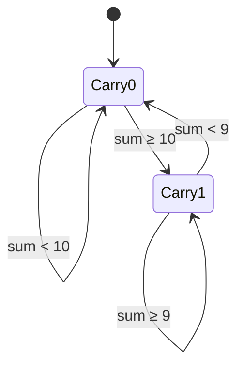

# Dynamic Programming Deep Dive

## 1. State Transition Diagrams

### Addition Carry FSM


## 2. DP Table Visualization

Multiplication partial products table for "123 × 456":

| i\j | 4 (10⁰) | 5 (10¹) | 6 (10²) |
|-----|---------|---------|---------|
| 3 (10⁰) | 12      | 15      | 18      |
| 2 (10¹) | 8       | 10      | 12      |
| 1 (10²) | 4       | 5       | 6       |

## 3. Performance Optimization

1. **Register Allocation**:
   ```assembly
   ; DP-optimized carry propagation
   add eax, ebx    ; sum = a + b
   adc edx, 0      ; carry flag handling
   ```

2. **Memory Access Patterns**:
   - Sequential access of digit arrays
   - Cache-friendly DP table layout

## 4. Extension Opportunities

1. **Karatsuba Algorithm**:
   ```python
   def multiply(x, y):
       if len(x) < threshold: return gradeschool(x, y)
       m = len(x)//2
       a, b = x[:m], x[m:]
       c, d = y[:m], y[m:]
       z0 = multiply(a, c)
       z1 = multiply(b, d)
       z2 = multiply(a+b, c+d)
       return z0*10^(2m) + (z2-z1-z0)*10^m + z1
   ```
